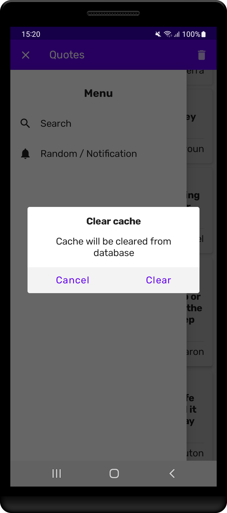
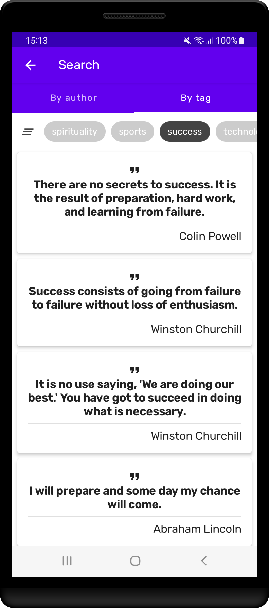
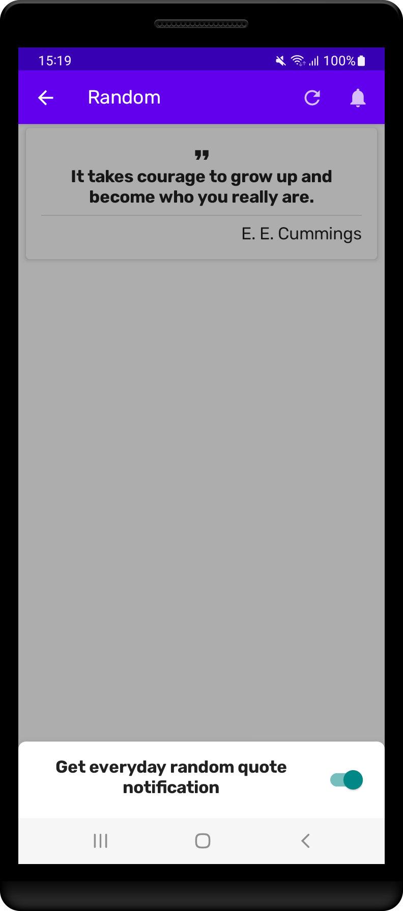
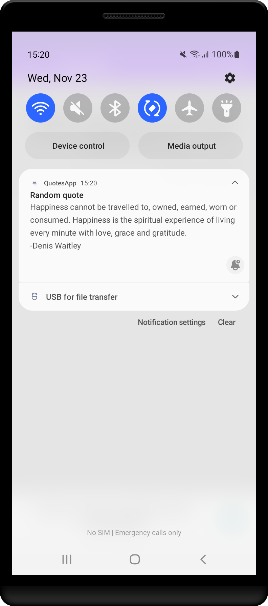

# QuotesApp

Used Quotable API: https://quotable.io/

Jetpack Compose, MVVM, Retrofit, Gson, Room, Paging, Hilt, Navigation, Accompanist Pager, WorkManager, Preferences DataStore.

In Quotes screen: paging list of quotes, drawer menu, button to clear cached in database quotes.

In Search screen: HorizontalPager with two tabs to search by author and search by tag. Icon to clear search filters.

In Random / Notification screen: turn on/off random quote notification in NotificationModalBottomSheetLayout to get notification by WorkManager once a day. Refresh icon to refetch random quote in screen.

 

 
